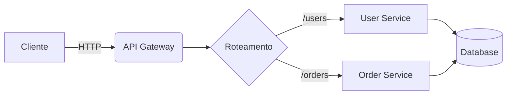

# 🎨 duno-slide

> **Gerador de slides minimalista e elegante inspirado nas lives de Python do [Eduardo Mendes (dunossauro)](https://github.com/dunossauro)** ✨

## 📖 Sobre

**duno-slide** é uma biblioteca Python criada como uma homenagem ao trabalho incrível do Eduardo Mendes (dunossauro) e suas famosas lives de Python. A ideia surgiu ao observar o layout limpo, minimalista e extremamente profissional que ele utiliza em suas apresentações.

Este projeto nasceu para democratizar esse estilo visual, permitindo que **qualquer pessoa na área de tecnologia** possa criar slides de alta qualidade apenas configurando um arquivo TOML, sem se preocupar com design ou ferramentas complexas.

### ✨ Principais características

- 🎯 **Simples e direto**: Configure seus slides em um arquivo TOML
- 🎨 **Layout profissional**: Inspirado nas apresentações do dunossauro
- 📊 **Mermaid integrado**: Crie diagramas facilmente
- 🌈 **GitHub highlights**: Syntax highlighting automático para código
- ⚡ **CLI com Typer**: Interface de linha de comando moderna (apresentado nas lives!)
- 📱 **Responsivo**: Suporta diferentes aspect ratios (16:9 e 4:3)

---

## 🚀 Instalação

```bash
pip install duno-slide
```

Para exportar apresentações (PDF/PNG), instale com suporte ao Playwright:

```bash
pip install duno-slide[export]
playwright install chromium
```

---

## 💻 CLI - Interface de linha de comando

O **duno-slide** possui uma CLI construída com [Typer](https://typer.tiangolo.com/) (ferramenta apresentada nas lives!), oferecendo três comandos principais:

### 📡 `host` - Servir apresentação

Inicia um servidor local para visualizar sua apresentação no navegador com hot-reload automático.

```bash
duno-slide host presentation.toml
```

**Opções:**
- `--port`: Porta para servir (padrão: 8765)
- `--bind`: Endereço para bind (padrão: localhost)

**Exemplo:**
```bash
duno-slide host example.toml --port 8080 --bind 0.0.0.0
```

### 📄 `render` - Gerar HTML

Renderiza sua apresentação em um único arquivo HTML standalone.

```bash
duno-slide render presentation.toml -o output.html
```

**Opções:**
- `-o, --output`: Caminho do arquivo HTML de saída (padrão: presentation.html)

### 📦 `export` - Exportar PDF/PNG

Exporta sua apresentação para PDF ou imagens PNG usando Playwright.

```bash
duno-slide export presentation.toml -o presentation.pdf
```

**Opções:**
- `-o, --output`: Caminho do arquivo de saída (padrão: presentation.pdf)
- `-f, --format`: Formato de exportação: `pdf` ou `png` (padrão: pdf)
- `--width`: Largura customizada do viewport
- `--height`: Altura customizada do viewport

**Exemplo:**
```bash
duno-slide export example.toml -o slides.pdf -f pdf
duno-slide export example.toml -o slide_{index}.png -f png
```

---

## 🎨 Cores disponíveis

O **duno-slide** oferece uma paleta de cores cuidadosamente selecionada para manter suas apresentações limpas e profissionais:

| Cor | Nome | Código Hex | Uso Recomendado |
|-----|------|------------|-----------------|
| ⚪ | `white` | `#FFFFFF` | Fundos claros, conteúdo minimalista |
| ⚫ | `black` | `#2D2D2D` | Fundos escuros, slides finais |
| 🔴 | `red` | `#F28B7D` | Destaques importantes, alertas |
| 🟢 | `green` | `#81C784` | Sucessos, confirmações |
| 🟡 | `yellow` | `#F5D67A` | Avisos, atenção |
| 🔵 | `blue` | `#64B5F6` | Informações, seções técnicas |
| 🟣 | `indigo` | `#6272A4` | Títulos alternativos |
| 🟣 | `lavender` | `#BD93F9` | Slides especiais |
| 🌸 | `pink` | `#FF79C6` | Destaques suaves |

**Exemplo de uso:**
```toml
[[slides]]
layout = "default"
background = "blue"
title = "Minha seção técnica"
```

---

## 📐 Tipos de Slides

O **duno-slide** oferece 4 tipos de layouts, cada um otimizado para diferentes necessidades:

### 1. 🎯 `cover_title_right` - Capa com título à direita

Layout ideal para **slides de abertura de seção**, com título grande posicionado à direita.

```toml
[[slides]]
layout = "cover_title_right"
background = "red"
title = "A rede"
subtitle = "e as coisas dando errado!"
```

**Campos:**
- `title` (obrigatório): Título principal
- `subtitle` (opcional): Subtítulo
- `background` (obrigatório): Cor de fundo

---

### 2. 🎯 `cover_title_left` - Capa com título à esquerda

Variação do layout de capa com título posicionado à esquerda.

```toml
[[slides]]
layout = "cover_title_left"
background = "yellow"
title = "Clientes"
subtitle = "Existem tantos..."
```

**Campos:**
- `title` (obrigatório): Título principal
- `subtitle` (opcional): Subtítulo
- `background` (obrigatório): Cor de fundo

---

### 3. 📝 `default` - Slide padrão

Layout versátil para **conteúdo geral**, suportando Markdown, código, tabelas, listas e imagens.

```toml
[[slides]]
layout = "default"
background = "green"
title = "Listas e Tabelas"
vertical_align = "top"
content = """
## Principais protocolos

- **HTTP/HTTPS** — Comunicação web
- **WebSocket** — Comunicação bidirecional em tempo real
- **gRPC** — Remote Procedure Call de alta performance

| Protocolo  | Latência | Uso comum           |
|------------|----------|---------------------|
| HTTP/1.1   | Média    | APIs REST           |
| WebSocket  | Baixa    | Chat, jogos online  |
"""
footer = "Redes e Protocolos"
```

**Campos:**
- `title` (opcional): Título do slide
- `content` (opcional): Conteúdo em Markdown
- `vertical_align` (opcional): Alinhamento vertical - `top`, `center` ou `bottom` (padrão: top)
- `footer` (opcional): Texto de rodapé
- `background` (obrigatório): Cor de fundo

**Suporta:**
- ✅ Markdown (negrito, itálico, código inline)
- ✅ Listas ordenadas e não ordenadas
- ✅ Tabelas
- ✅ Blocos de código com syntax highlighting
- ✅ Imagens
- ✅ Diagramas Mermaid

---

### 4. 📋 `summary` - Slide de sumário

Layout em **duas colunas** ideal para agendas, índices e sumários.

```toml
[[slides]]
layout = "summary"
background = "green"
title = "Agenda"

[[slides.items]]
title = "Introdução"
description = "Contexto e objetivos"

[[slides.items]]
title = "Arquitetura"
description = "Design do sistema"

[[slides.items]]
title = "Implementação"
description = "Código e exemplos"
```

**Campos:**
- `title` (opcional): Título do slide
- `items` (obrigatório): Lista de itens
  - `title` (obrigatório): Título do item
  - `description` (opcional): Descrição do item
- `footer` (opcional): Texto de rodapé
- `background` (obrigatório): Cor de fundo

> **💡 Dica:** Os itens são automaticamente distribuídos em duas colunas balanceadas!

---

## 🔥 Recursos Especiais

### 📊 Integração com Mermaid

Crie diagramas diretamente no seu slide usando a sintaxe Mermaid:

````toml
[[slides]]
layout = "default"
background = "green"
title = "Diagrama Mermaid"
content = """
### Fluxo de requisição


"""
````

### 💻 Syntax Highlighting com GitHub

Todo código é automaticamente destacado usando o tema **GitHub Dark**:

````toml
[[slides]]
layout = "default"
background = "blue"
title = "Código Python"
content = """
```python
import httpx

def fetch_with_retry(url: str, max_retries: int = 3):
    for attempt in range(max_retries):
        try:
            response = httpx.get(url, timeout=5.0)
            return response.json()
        except httpx.HTTPError as e:
            print(f"Tentativa {attempt + 1} falhou")
    raise Exception("Todas as tentativas falharam")
```
"""
````

**Linguagens suportadas:** Python, JavaScript, Bash, SQL, JSON, YAML, HTML, CSS, e muitas outras!

---

## 📝 Estrutura do arquivo TOML

Todo arquivo de apresentação segue esta estrutura básica:

```toml
# Metadados da apresentação
title = "Minha Apresentação"
aspect_ratio = "16:9"  # ou "4:3"

# Slide 1
[[slides]]
layout = "cover_title_right"
background = "red"
title = "Bem-vindo"
subtitle = "À minha apresentação"

# Slide 2
[[slides]]
layout = "default"
background = "blue"
title = "Conteúdo"
content = """
Seu conteúdo em **Markdown** aqui!
"""

# Mais slides...
```

---

## 🎓 Exemplo Completo

Veja o arquivo [`example.toml`](./example.toml) no repositório para um exemplo completo demonstrando todos os recursos!

Para visualizar o exemplo:

```bash
duno-slide host example.toml
```

Depois acesse: http://localhost:8765

---

## 🙏 Agradecimentos

Este projeto é uma homenagem ao trabalho excepcional do [Eduardo Mendes (dunossauro)](https://github.com/dunossauro) e sua dedicação em compartilhar conhecimento através de suas lives de Python no YouTube.

Se você ainda não conhece o trabalho dele, não deixe de conferir:
- 📺 [Canal no YouTube - Live de Python](https://www.youtube.com/@dunossauro)
- 🐦 [Twitter/X](https://twitter.com/dunossauro)
- 💻 [GitHub](https://github.com/dunossauro)

---

## 📜 Licença

Este projeto é distribuído sob a licença especificada no repositório.

---

## 🤝 Contribuindo

Contribuições são bem-vindas! Sinta-se à vontade para abrir issues ou pull requests.

---

**Feito com ❤️ inspirado nas lives de Python do dunossauro**

